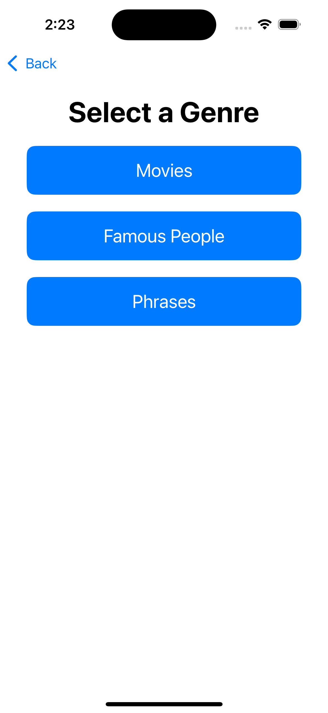
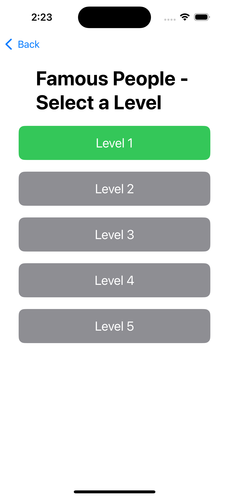
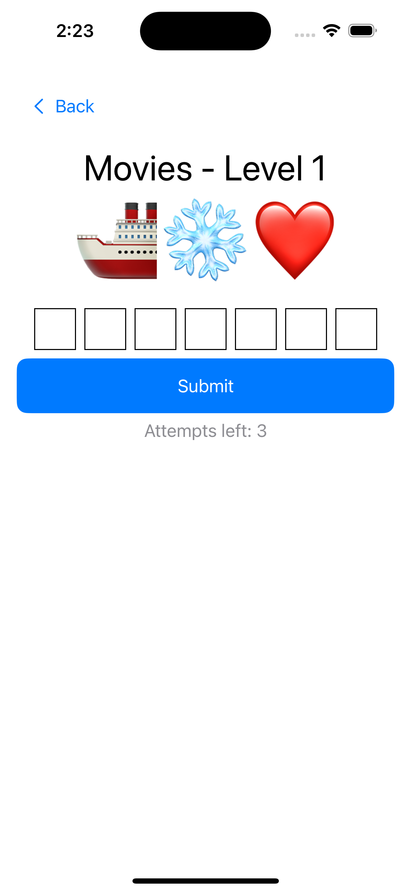
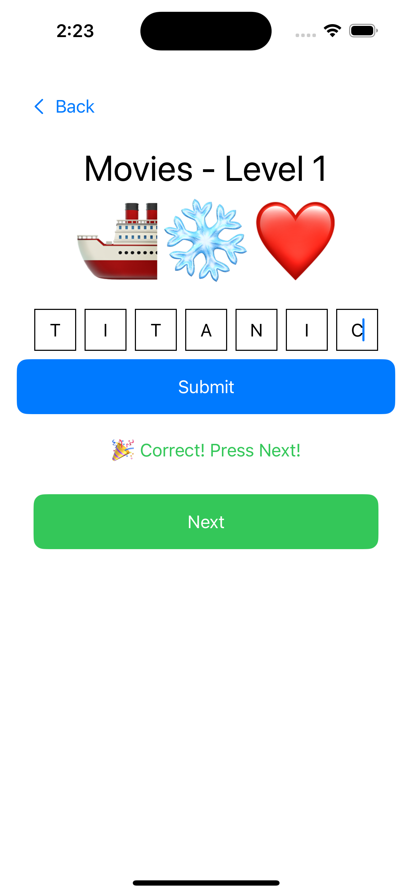
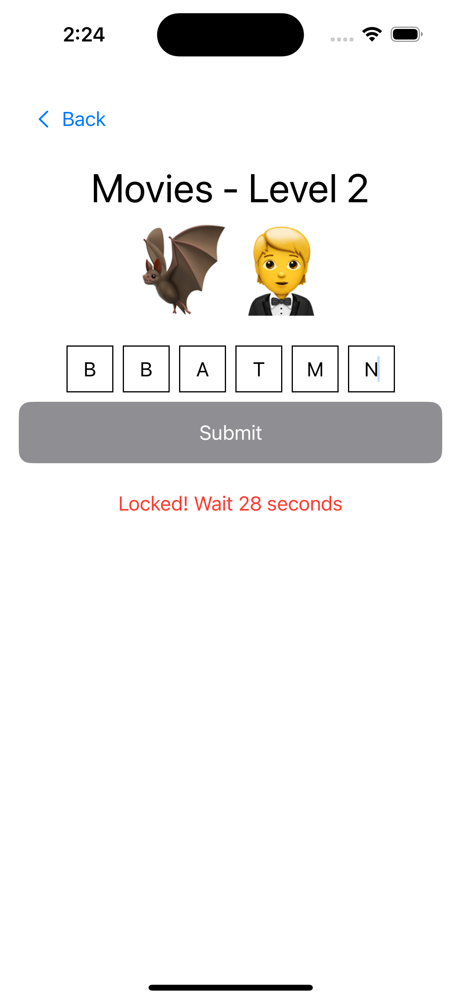

# Emoji Odyssey

Emoji Odyssey is a fun and interactive word puzzle game where players guess words based on emoji clues. The game includes multiple genres, each with different levels to challenge the players.

## Features

- **Multiple Genres:** Choose from categories like Movies, Famous People, and Phrases.
- **Level Progression:** Unlock levels as you complete challenges.
- **Lockout Timer:** Prevents multiple incorrect attempts within a short period.
- **Sound Effects:** Engaging audio feedback for correct and incorrect answers.
- **Responsive Design:** Adaptive layout for different screen sizes.

## Screenshots


### Sign-In Page


### Genre Selection


### Level Selection


### Game Screen


### Correct Answer


### Incorrect Answer


## How to Play

1. **Sign In** - Enter your name and age to begin.
2. **Select a Genre** - Choose from Movies, Famous People, or Phrases.
3. **Pick a Level** - Start with level 1 and unlock higher levels as you progress.
4. **Guess the Word** - Use the emojis as hints to type the correct word.
5. **Submit Your Answer** - Get instant feedback on your guess.
6. **Move to the Next Level** - If correct, proceed to the next level; otherwise, retry after the lockout timer ends.

## Installation

1. Clone the repository:
   ```sh
   git clone https://github.com/Tharanitharan-M/emoji-odyssey.git
   ```
2. Open the project in Xcode.
3. Run the project on an iOS simulator or device.

## Dependencies
- SwiftUI for UI design
- AVKit for sound effects

## Future Enhancements
- More genres and levels
- Advanced hint system
- Multiplayer mode

## Contributing
Feel free to contribute by submitting pull requests or reporting issues.

## License
This project is licensed under the MIT License.
